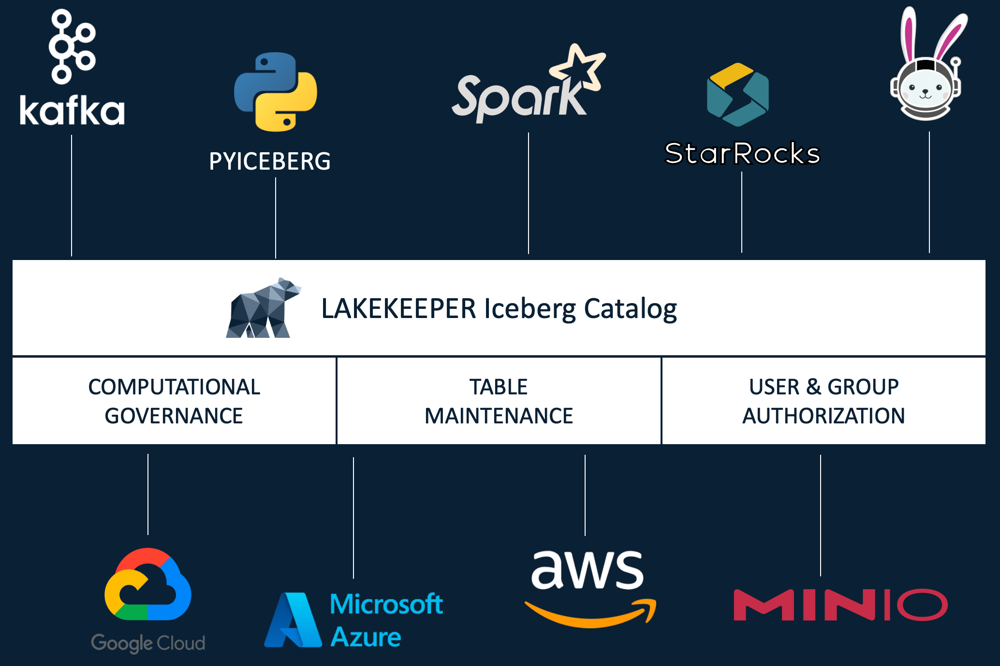

# Lakekeeper

Lakekeeper is a **secure**, **fast** and **easy to use** Apache Iceberg REST Catalog implementation written in Rust.
Start by reading [Getting Started](getting-started.md), then check the [Documentation](docs/nightly/index.md) for more details information.

## Features

- **Written in Rust**: Single all-in-one binary - no JVM or Python env required.
- **Storage Access Management**: Lakekeeper secures access to your data using [Vended-Credentials](ToDo) and [remote signing for S3](ToDo). All major Hyperscalers (AWS, Azure, GCP) as well as on-premise deployments with S3 are supported.
- **Openid Provider Integration**: Use your own identity provider for authentication, just set `LAKEKEEPER__OPENID_PROVIDER_URI` and you are good to go.
- **Native Kubernetes Integration**: Use our helm chart to easily deploy high available setups and natively authenticate kubernetes service accounts with Lakekeeper. Kubernetes and OpenID authentication can be used simultaneously.
- **Change Events**: Built-in support to emit change events (CloudEvents), which enables you to react to any change that happen to your tables.
- **Change Approval**: Changes can also be prohibited by external systems. This can be used to prohibit changes to tables that would invalidate Data Contracts, Quality SLOs etc. Simply integrate with your own change approval via our `ContractVerification` trait.
- **Multi-Tenant capable**: A single deployment of Lakekeeper can serve multiple projects - all with a single entrypoint. Each project itself supports multiple Warehouses to which compute engines can connect.
- **Customizable**: Lakekeeper is meant to be extended. We expose the Database implementation (`Catalog`), `SecretsStore`, `Authorizer`, Events (`CloudEventBackend`) and `ContractVerification` as interfaces (Traits). This allows you to tap into any access management system of your company or stream change events to any system you like - simply by implementing a handful methods.
- **Well-Tested**: Integration-tested with `spark`, `pyiceberg`, `trino` and `starrocks`.
- **High Available & Horizontally Scalable**: There is no local state - the catalog can be scaled horizontally easily.
- **Fine Grained Access (FGA):** Lakekeeper's default Authorization system leverages [OpenFGA](https://openfga.dev/). If your company already has a different system in place, you can integrate with it by implementing a handful of methods in the `Authorizer` trait.

If you are missing something, we would love to hear about it in a [Github Issue](https://github.com/lakekeeper/lakekeeper/issues/new).

Lakekeeper is an implementation of the Apache Iceberg REST Catalog API. Currently Lakekeeper depends on the following external dependencies:

* **Persistence Backend / Catalog** (required): We currently support only Postgres, but plan to expand our support to more Databases in the future.
* **Warehouse Storage** (required): On creation of a [Warehouse](Todo: Entity Warehouse Link), 
* **Identity Provider** (optional): Lakekeeper can Authenticate incoming requests using any OIDC capable Identity Provider (IdP).
* **Authorization System** (optional): For permission management, Lakekeeper uses the wonderful [OpenFGA](http://openfga.dev) Project. OpenFGA is automatically deployed in our docker-compose and helm installations. Authorization can only be used if Lakekeeper is connected to an Identity Provider.
* **Secret Store** (optional): By default, Lakekeeper stores all secrets (i.e. S3 access credentials) encrypted in the Persistence Backend. To increase security, Lakekeeper can also use external systems to store secrets. Currently all Hashicorp-Vault like stores are supported.
* **Event Store** (optional): Lakekeeper can send Change Events to an Event Store. Currently [Nats](http://nats.io) is supported, we are working on support for [Apache Kafka](http://kafka.apache.org)
* **Data Contract System** (optional): Lakekeeper can interface with external data contract systems to prohibit breaking changes to your tables.

Please check the [User Guide] for information on configuration.

Lakekeeper serves two APIs with different purposes:

1. The Iceberg REST API is served at endpoints prefixed with `/catalog`. External query engines connect to this API to interact with the catalog. Lakekeeper also implements the S3 remote signing API which is hosted at `/<warehouse-id>/v1/aws/s3/sign`. ToDo: Swagger
1. The Lakekeeper Management API is served at endpoints prefixed with `/management`. It is used to configure Lakekeeper and manage entities that are not part of the Iceberg REST Catalog specification, such as permissions.

